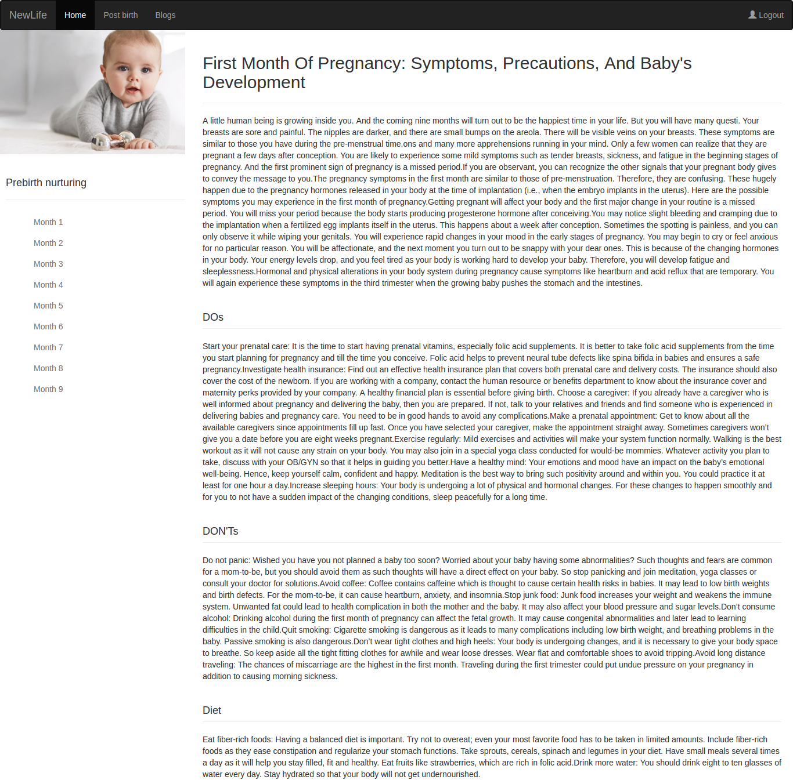

# NewLife
NewLife is a platform (web and API based) which provides all sorts of information about expecting mothers and mothers with new born child. It will act as a single source of varied information. Presently it has features for showing prenatal and postnatal information. It can be considered as an effective content management system in itself. Also it has feature for writing blogs which can be helpful for mothers. Admin can add new information, month wise which may prove to be useful for mothers.

## Stack used
- Flask : Webframework in Python
- Postgres : Database
- flask-admin : For craeting admin
- flask-login : For creating auth system
- SQLAlchemy : ORM
- gunicorn : Web Server
- Heroku : Deployment
- summernote.js: Rich Text edittor
- Bootstrap3
- AngularJS

## Building the app locally

**The app has been developed on Ubuntu 16.04 platform. The following instructions having given keeping Ubuntu OS in mind.
However with some changes the app can easily be setup on other platforms like Arch or rpm based systems**

Please follow the below given instructions to build the app locally

### Getting the source code
- Clone this repository using ``` https://github.com/djmgit/NewLife.git ```
### Installing dependencies
- This project is developed using python3. Make sure you have python3 installed.
- Open the repository in your terminal. Make sure you are in the root of the repo. Execute the following-

  ``` pip install -r requirements.txt ```
  
  This will install all the dependencies for this app.
  
  If you encounter permission issues, please execute the above command with superuser access. For debian based systems like
  Ubuntu the command will be-
  
  ``` sudo pip install -r requirements.txt ```
  
  You may use virtualenv for building this app if you do not want to install dependencies in your global space.
### Installing Database
Execute the following to install Postgres on your system-
```
sudo apt-get update
sudo apt-get install postgresql postgresql-contrib
```
This will install Postgres on your system.
Next you need to create a database where you will be creating tables for this project.
By default Postgres creates a role (user) named after your system username (the username by which you are currently logged in) and a database names postgres.
In order to create a new database and get familiar with Postgres follow this article-
[Setting up Postgres onn Ubuntu](https://www.digitalocean.com/community/tutorials/how-to-install-and-use-postgresql-on-ubuntu-16-04)

After Postgres is up and running you will have to apply migrations for your app and create tables.
For this execute the following from the project root.

```
python app/manage.py db init
python app/manage.py db migrate
python app/manage.py db upgrade

```

This will create tables and apply migrations.

### Running the app
Finally run the app using the following:
```
python app/main.py
```
This will start the development server at 127.0.0.1 (localhost) and port 5000

Now visit the following URL in your browser:
```
htttp://127.0.0.1:5000
```
The fron end has been tested on **Google Chrome** and **Firefox**

### Using the app

<table>
<tr>
<td></td>
</tr>
</table>
You can view the **Prenatal instructions and articles** in the prebirth section. These can be updated and maintained admin
<table>
<tr>
<td></td>
</tr>
</table>
You can view the **Postnatal instructions and articles** in the postbirth section. These can be updated and maintained admin
<table>
<tr>
<td></td>
</tr>
</table>
You can view the **blogs** in the blogs section. These can be published by anyone who has an account
<table>
<tr>
<td></td>
</tr>
</table>
You can write **blogs** using the Rich Text edittor. If the Rich Text editor does not show up, make sure
you enable script loading in the upper right corner of your browser's search bar.
<table>
<tr>
<td></td>
</tr>
</table>

The entire app is API based, and so it acn be easily used on mobile devices with minimum performance issues.

### Admin system

NewLife has got a functional admin system. Admin can update app content, update prenatal and postnatal content, edit blogs
(to remove any unwanted conent).

Admin system can be found at :
https://newlifegenesis.herokuapp.com/admin/
For testing purpose:
Email: admin@admin.com
Password: admin123

Use the above credentials to explore the admin system.

### APIs

NewLife is API based. That is, the back end, exposes most if its features and contents as REST APIs.


